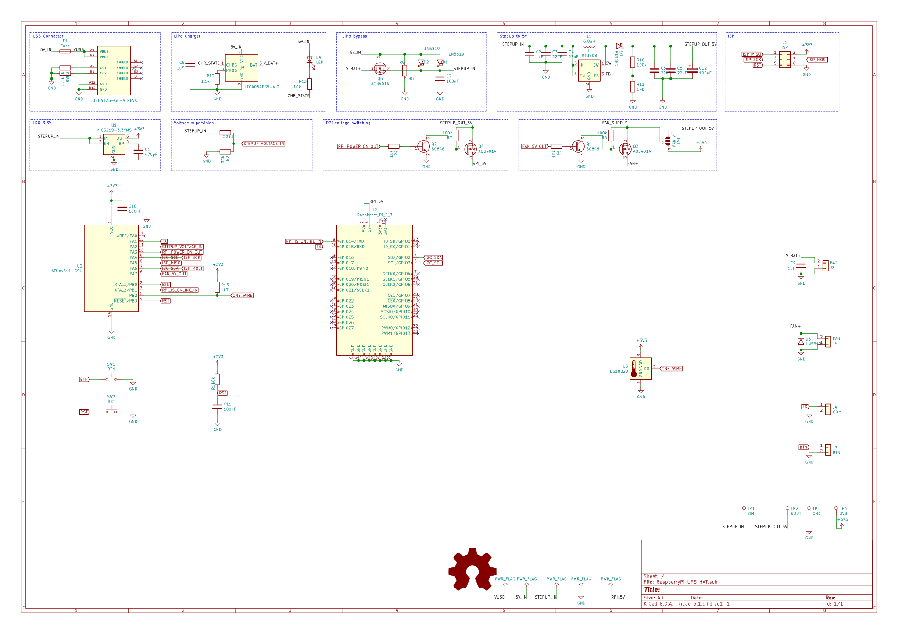
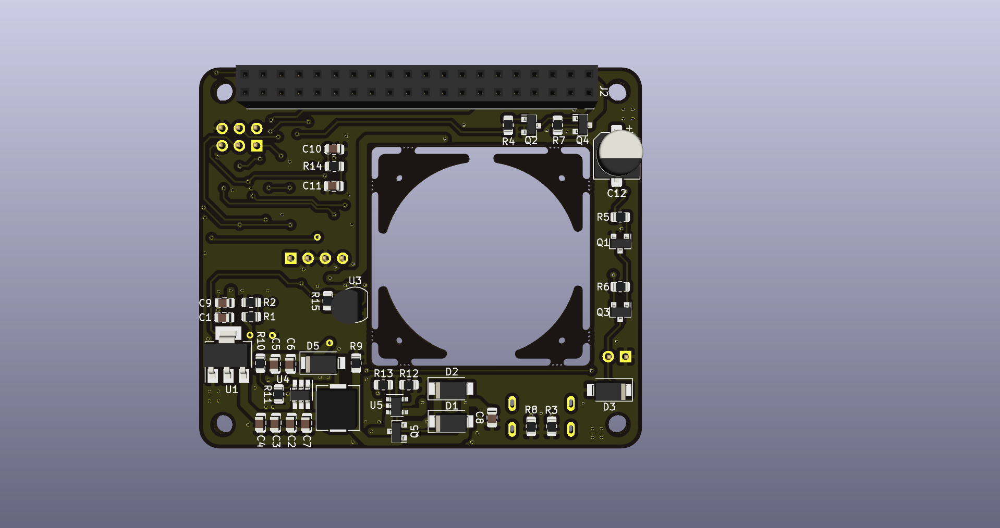
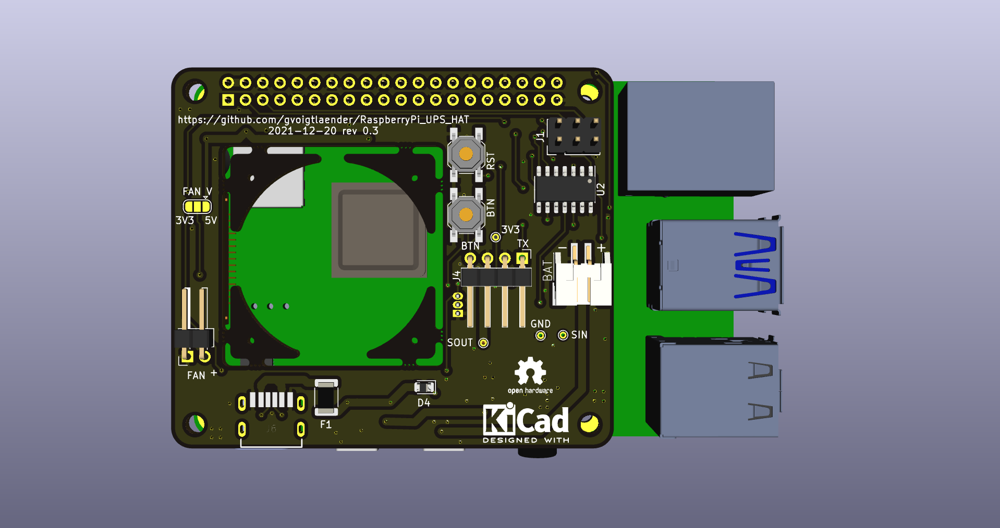
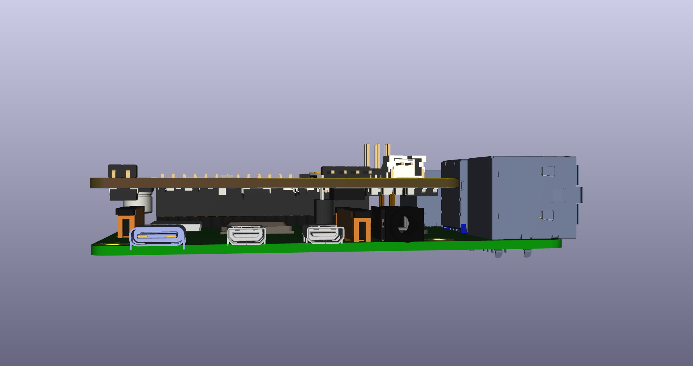
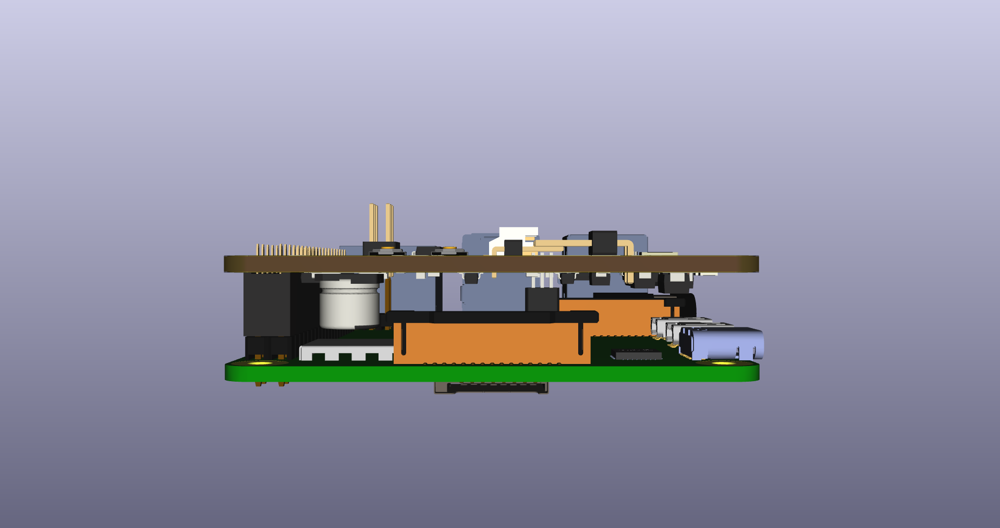
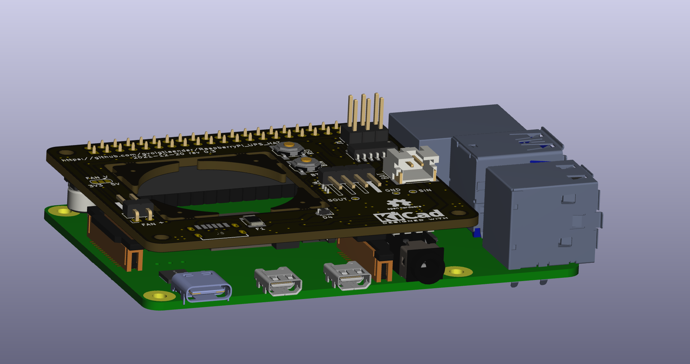

# RaspberryPi_UPS_HAT
## RaspberryPi UPS HAT, LIPO, Fan Control, I2C

## Project goals:
* provide backup battery (LiPo 3.7V) with I2C status interface
* small footprint to integrate into given RaspberrryPi case (LABISTS Starter Kit)
* integrated fan control (temperature based)
* onboard programmer interface (ISP)
* I2C based RPI ups service for Battery supervision, logging and shutdown (systemd, python3, smbus)

## Used items:
* Attiny 841 CPU
* LTC4054 LiPo Charger
* MT3606 Step-Up (LiPo > 5V)
* MIC5219 LDO (5V > 3.3V)
* USB Type-C connector
* resistors, capacitory (SMD 0805)

## Schematic:

## PCB:

